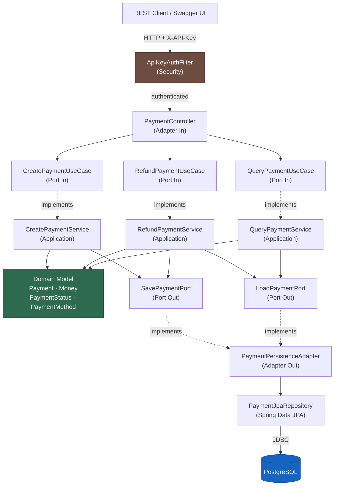

# HexaPay — Payment API

[](https://github.com/Zezoca29/payment-api-hexagonal/actions/workflows/ci-cd.yml)
[](https://codecov.io/gh/Zezoca29/payment-api-hexagonal)
[](https://adoptium.net/)
[](https://spring.io/projects/spring-boot)
[](https://www.postgresql.org/)
[](https://www.docker.com/)
[](https://opensource.org/licenses/MIT)

> **Production-grade REST API for payment processing**, built with **Hexagonal Architecture** (Ports & Adapters).  
> Demonstrates domain isolation, comprehensive testing, and an automated CI/CD pipeline — the engineering standards expected at senior level.

---

## Table of Contents

- [Architecture](#architecture)
- [Features](#features)
- [Tech Stack](#tech-stack)
- [Quick Start](#quick-start)
- [Authentication](#authentication)
- [API Reference](#api-reference)
- [Running Tests](#running-tests)
- [Project Structure](#project-structure)
- [Architecture Decision Records](#architecture-decision-records)
- [Git Flow](#git-flow)
- [Contributing](#contributing)

---

## Architecture

This project implements **Hexagonal Architecture** (Ports & Adapters), coined by Alistair Cockburn. The central principle: the **domain is fully isolated from all infrastructure concerns**. Frameworks, databases, and HTTP are implementation details.

### Dependency Flow



### Dependency Rule

All source-code dependencies point **inward only**:

```
HTTP Adapter  →  Port Interface (in)  ←  Service  →  Port Interface (out)  ←  JPA Adapter  →  PostgreSQL
```

The domain (`Payment`, `Money`, etc.) depends on **nothing**. It can be tested with zero infrastructure.

### Why this matters for payments

Payments is one of the most regulated, audited, and failure-sensitive domains in software. Hexagonal architecture makes explicit the answer to "where does this rule live?": always in the domain, never in a controller or repository.

---

## Features

- **Full payment lifecycle**: create, query, refund, filter by status / date range / merchant
- **Explicit state machine**: `PENDING` → `COMPLETED` → `REFUNDED` | `PENDING` → `FAILED`
- **API Key authentication** — stateless security via `X-API-Key` header (configurable per environment)
- **Paginated list endpoints** — all listing operations return `content`, `totalElements`, `totalPages`, `pageNumber`, `pageSize`
- **Business rules in the domain**, not controllers (tested without Spring)
- **Bean Validation** at the HTTP boundary, not inside business logic
- **Standardized error responses** with error codes and timestamps
- **OpenAPI 3 / Swagger UI** — interactive documentation at `/swagger-ui.html`
- **Flyway versioned migrations** — reproducible schema across all environments
- **Spring Actuator** health and metrics endpoints
- **JaCoCo coverage report** — minimum 80% enforced as a build gate
- **GitHub Actions CI/CD** — test, coverage, Docker build, push to GHCR
- **Docker Compose** — entire stack up with a single command

---

## Tech Stack

| Layer          | Technology                              |
|----------------|-----------------------------------------|
| Language       | Java 21 (LTS)                           |
| Framework      | Spring Boot 3.4                         |
| Security       | Spring Security (API Key, stateless)    |
| Database       | PostgreSQL 16                           |
| ORM            | Spring Data JPA / Hibernate 6           |
| Migrations     | Flyway                                  |
| Documentation  | SpringDoc OpenAPI 3 (Swagger UI)        |
| Testing        | JUnit 5 + Mockito + TestContainers      |
| Coverage       | JaCoCo (≥ 80% enforced)                 |
| CI/CD          | GitHub Actions                          |
| Containerization | Docker + Docker Compose               |
| Registry       | GitHub Container Registry (GHCR)        |

---

## Quick Start

### Prerequisites

| Tool | Minimum version | Purpose |
|------|----------------|---------|
| Docker | 24+ | Run the full stack (DB + API) |
| Docker Compose V2 | 2.20+ | Orchestrate containers |
| Java | 21 (LTS) | Local development & tests |
| Maven | 3.9+ | Build & dependency management |

> **Tip:** You only need Java + Maven if you want to run tests or develop locally. Running with Docker Compose requires only Docker.

---

### Option 1 — Docker Compose (recommended)

The fastest way to get the entire stack running:

```bash
# 1. Clone the repository
git clone https://github.com/Zezoca29/payment-api-hexagonal.git
cd payment-api-hexagonal

# 2. Start PostgreSQL + API (builds the image on first run)
docker compose up --build

# 3. Verify the application is up
curl http://localhost:8080/actuator/health
# Expected: {"status":"UP"}

# 4. Access the interactive API documentation
# http://localhost:8080/swagger-ui.html
```

The default API key for local development is `change-me-in-production` (set in `application.yml`).  
Override it via the `API_KEY` environment variable (see [Authentication](#authentication)).

---

### Option 2 — Local Development Mode

Run only the database in Docker and the application from source (enables hot-reload and verbose SQL logging):

```bash
# Step 1 — Start only the PostgreSQL container
docker compose up postgres -d

# Verify the database is ready
docker compose ps
# postgres should show "healthy"

# Step 2 — Run the app with the 'local' profile
#   - Enables verbose SQL logging (show-sql: true)
#   - Connects to localhost:5432/paymentsdb
mvn spring-boot:run -Dspring-boot.run.profiles=local

# Step 3 — Confirm startup (look for this log line)
# INFO  c.h.p.PaymentApiApplication - Started PaymentApiApplication in X.XXX seconds
```

---

### Environment Variables Reference

| Variable | Default | Description |
|----------|---------|-------------|
| `API_KEY` | `change-me-in-production` | API key required in the `X-API-Key` header |
| `DATABASE_URL` | `jdbc:postgresql://localhost:5432/paymentsdb` | Full JDBC connection URL |
| `DATABASE_USERNAME` | `payments` | Database username |
| `DATABASE_PASSWORD` | `payments` | Database password |
| `SERVER_PORT` | `8080` | HTTP port the application listens on |

**Example — override the API key via Docker Compose:**

```bash
API_KEY=my-secret-key-123 docker compose up --build
```

---

### Verify the Application is Running

```bash
# Health check (no API key required)
curl http://localhost:8080/actuator/health

# Swagger UI (no API key required)
open http://localhost:8080/swagger-ui.html   # macOS
start http://localhost:8080/swagger-ui.html  # Windows

# First API call (API key required)
curl -X POST http://localhost:8080/api/v1/payments \
  -H "Content-Type: application/json" \
  -H "X-API-Key: change-me-in-production" \
  -d '{"merchantId":"loja-001","amount":99.90,"currency":"BRL","paymentMethod":"PIX","description":"Test"}'
```

---

### Troubleshooting

| Problem | Likely cause | Solution |
|---------|-------------|----------|
| `Connection refused` on port 5432 | PostgreSQL not started | Run `docker compose up postgres -d` |
| `FlywayException: Validate failed` | Schema mismatch | Run `docker compose down -v && docker compose up` to reset the DB volume |
| `401 Unauthorized` on API calls | Missing or wrong API key | Add `-H "X-API-Key: <your-key>"` to every request |
| Port 8080 already in use | Another service on the port | Set `SERVER_PORT=8081` or stop the conflicting process |

---

## Authentication

All `/api/v1/**` endpoints require a valid API key in the `X-API-Key` request header.  
Public endpoints (Swagger UI, health check, OpenAPI docs) do **not** require authentication.

```bash
# Every API call must include this header
-H "X-API-Key: <your-api-key>"
```

| Endpoint pattern | Auth required |
|-----------------|--------------|
| `GET /actuator/health` | No |
| `GET /swagger-ui/**` | No |
| `GET /api-docs/**` | No |
| `POST /api/v1/payments` | **Yes** |
| `GET /api/v1/payments/**` | **Yes** |
| `POST /api/v1/payments/{id}/refund` | **Yes** |

**Responses when authentication fails:**

```json
{
  "code": "UNAUTHORIZED",
  "message": "Invalid or missing API key. Provide the X-API-Key header.",
  "timestamp": "2024-06-01T10:30:00.000Z"
}
```

> **Production note:** Set a strong, randomly generated key via the `API_KEY` environment variable.  
> Never commit real keys to source control.

---

## API Reference

Full interactive documentation: **`http://localhost:8080/swagger-ui.html`**

### Endpoints Summary

| Method   | Endpoint                          | Description                         | Auth | Status Codes           |
|----------|-----------------------------------|-------------------------------------|------|------------------------|
| `POST`   | `/api/v1/payments`                | Create a new payment                | Yes  | 201, 400, 401, 422     |
| `GET`    | `/api/v1/payments/{id}`           | Get payment by ID                   | Yes  | 200, 401, 404          |
| `POST`   | `/api/v1/payments/{id}/refund`    | Refund a payment                    | Yes  | 200, 401, 404, 409, 422|
| `GET`    | `/api/v1/payments?status=...`     | Filter by status (paginated)        | Yes  | 200, 401               |
| `GET`    | `/api/v1/payments?from=...&to=...`| Filter by date range (paginated)    | Yes  | 200, 400, 401          |
| `GET`    | `/api/v1/payments?merchantId=...` | Filter by merchant (paginated)      | Yes  | 200, 401               |

> **Pagination params** (apply to all list endpoints): `page` (0-based, default `0`) and `size` (default `20`, max `100`).

### Create a Payment

```bash
curl -X POST http://localhost:8080/api/v1/payments \
  -H "Content-Type: application/json" \
  -H "X-API-Key: change-me-in-production" \
  -d '{
    "merchantId": "loja-abc-001",
    "amount": 299.90,
    "currency": "BRL",
    "paymentMethod": "PIX",
    "description": "Pedido #7842 — Tênis Nike Air Max"
  }'
```

**Response `201 Created`:**
```json
{
  "id": "550e8400-e29b-41d4-a716-446655440000",
  "merchantId": "loja-abc-001",
  "amount": 299.90,
  "currency": "BRL",
  "paymentMethod": "PIX",
  "description": "Pedido #7842 — Tênis Nike Air Max",
  "status": "PENDING",
  "externalReference": null,
  "failureReason": null,
  "createdAt": "2024-06-01T10:30:00",
  "updatedAt": "2024-06-01T10:30:00",
  "refundedAt": null
}
```

### Refund a Payment

```bash
curl -X POST http://localhost:8080/api/v1/payments/550e8400-e29b-41d4-a716-446655440000/refund \
  -H "X-API-Key: change-me-in-production"
```

### Filter by Status (paginated)

```bash
# First page, default size (20)
curl -H "X-API-Key: change-me-in-production" \
  "http://localhost:8080/api/v1/payments?status=COMPLETED"

# Second page, 10 items per page
curl -H "X-API-Key: change-me-in-production" \
  "http://localhost:8080/api/v1/payments?status=COMPLETED&page=1&size=10"
```

**Paginated Response format:**

```json
{
  "content": [
    {
      "id": "550e8400-e29b-41d4-a716-446655440000",
      "merchantId": "loja-abc-001",
      "amount": 299.90,
      "currency": "BRL",
      "paymentMethod": "PIX",
      "status": "COMPLETED",
      "createdAt": "2024-06-01T10:30:00"
    }
  ],
  "pageNumber": 0,
  "pageSize": 20,
  "totalElements": 42,
  "totalPages": 3
}
```

### Filter by Date Range

```bash
curl -H "X-API-Key: change-me-in-production" \
  "http://localhost:8080/api/v1/payments?from=2024-06-01T00:00:00&to=2024-06-30T23:59:59"
```

### Payment Methods

| Value           | Description                                      |
|-----------------|--------------------------------------------------|
| `PIX`           | Brazilian instant payment (Banco Central)        |
| `BOLETO`        | Brazilian bank slip                              |
| `CREDIT_CARD`   | Credit card (Visa, Mastercard, Amex, etc.)       |
| `DEBIT_CARD`    | Debit card                                       |
| `BANK_TRANSFER` | Standard wire transfer (TED/DOC)                 |

### Error Response Format

```json
{
  "code": "PAYMENT_NOT_FOUND",
  "message": "Payment not found with ID: 550e8400-...",
  "timestamp": "2024-06-01T10:30:00.000Z"
}
```

| HTTP Code | Error Code                   | Trigger                                  |
|-----------|------------------------------|------------------------------------------|
| `400`     | `VALIDATION_ERROR`           | Invalid request body (Bean Validation)   |
| `400`     | `INVALID_ARGUMENT`           | Invalid enum value or date range         |
| `401`     | `UNAUTHORIZED`               | Missing or invalid `X-API-Key` header    |
| `404`     | `PAYMENT_NOT_FOUND`          | Payment ID does not exist                |
| `409`     | `PAYMENT_ALREADY_REFUNDED`   | Attempted double refund                  |
| `422`     | `INVALID_PAYMENT_STATE`      | State transition not allowed             |
| `500`     | `INTERNAL_ERROR`             | Unexpected server error                  |

---

## Running Tests

```bash
# Run unit tests only (fast, no infrastructure needed)
mvn test

# Run all tests + generate JaCoCo coverage report
mvn verify

# View the HTML coverage report
start target/site/jacoco/index.html   # Windows
open target/site/jacoco/index.html    # macOS/Linux
```

### Test Pyramid

```
                        ┌──────────────┐
                        │  Integration │  (TestContainers + full HTTP stack)
                       ┌┤    Tests     ├┐
                      ┌┤└──────────────┘├┐
                     ┌┤  Application    ├┐│
                    ┌┤│   Unit Tests    │├┐│
                   ┌┤ │  (Mocked ports) │ ├┐│
                  ┌┤  └─────────────────┘  ├┐│
                 ┌┤       Domain          ├┐│
                ─┤─    Unit Tests         ├─┤─
                 └┤  (Pure Java, no mocks)├┘
```

| Test type      | Location                   | What it tests                          | Infra needed |
|----------------|----------------------------|----------------------------------------|--------------|
| Domain unit    | `unit/domain/`             | Business rules, state transitions      | None         |
| Use case unit  | `unit/application/`        | Orchestration with mocked ports        | None         |
| Integration    | `integration/`             | Full HTTP → DB → HTTP round-trip       | PostgreSQL   |

---

## Project Structure

```
.
├── .github/
│   └── workflows/
│       └── ci-cd.yml              ← GitHub Actions pipeline
├── docs/
│   └── adr/                       ← Architecture Decision Records
│       ├── ADR-001-hexagonal-architecture.md
│       ├── ADR-002-postgresql-database.md
│       └── ADR-003-flyway-migrations.md
├── src/
│   ├── main/
│   │   ├── java/com/hexapay/payments/
│   │   │   ├── PaymentApiApplication.java
│   │   │   │
│   │   │   ├── domain/                    ← CORE — zero framework dependencies
│   │   │   │   ├── model/
│   │   │   │   │   ├── Payment.java       ← Aggregate root with business rules
│   │   │   │   │   ├── Money.java         ← Value object (immutable record)
│   │   │   │   │   ├── PaymentPage.java   ← Paginated result (framework-free)
│   │   │   │   │   ├── PaymentStatus.java ← State enum
│   │   │   │   │   └── PaymentMethod.java ← Method enum
│   │   │   │   ├── port/
│   │   │   │   │   ├── in/                ← Driving ports (use case interfaces)
│   │   │   │   │   │   ├── CreatePaymentUseCase.java
│   │   │   │   │   │   ├── RefundPaymentUseCase.java
│   │   │   │   │   │   └── QueryPaymentUseCase.java
│   │   │   │   │   └── out/               ← Driven ports (repository interfaces)
│   │   │   │   │       ├── SavePaymentPort.java
│   │   │   │   │       └── LoadPaymentPort.java
│   │   │   │   └── exception/
│   │   │   │       ├── PaymentNotFoundException.java
│   │   │   │       ├── PaymentAlreadyRefundedException.java
│   │   │   │       └── InvalidPaymentStateException.java
│   │   │   │
│   │   │   ├── application/               ← Orchestration (no business rules)
│   │   │   │   └── usecase/
│   │   │   │       ├── CreatePaymentService.java
│   │   │   │       ├── RefundPaymentService.java
│   │   │   │       └── QueryPaymentService.java
│   │   │   │
│   │   │   ├── adapters/
│   │   │   │   ├── in/web/                ← Primary adapter: REST API
│   │   │   │   │   ├── PaymentController.java
│   │   │   │   │   ├── dto/
│   │   │   │   │   │   ├── CreatePaymentRequest.java
│   │   │   │   │   │   ├── PaymentResponse.java
│   │   │   │   │   │   ├── PagedPaymentResponse.java  ← Pagination wrapper
│   │   │   │   │   │   └── ErrorResponse.java
│   │   │   │   │   ├── mapper/
│   │   │   │   │   │   └── PaymentWebMapper.java
│   │   │   │   │   └── handler/
│   │   │   │   │       └── GlobalExceptionHandler.java
│   │   │   │   └── out/persistence/       ← Secondary adapter: JPA + PostgreSQL
│   │   │   │       ├── PaymentPersistenceAdapter.java
│   │   │   │       ├── PaymentJpaRepository.java
│   │   │   │       ├── entity/
│   │   │   │       │   └── PaymentEntity.java
│   │   │   │       └── mapper/
│   │   │   │           └── PaymentPersistenceMapper.java
│   │   │   │
│   │   │   └── config/
│   │   │       ├── OpenApiConfig.java
│   │   │       └── SecurityConfig.java    ← API Key authentication setup
│   │   │           └── security/
│   │   │               └── ApiKeyAuthFilter.java
│   │   │
│   │   └── resources/
│   │       ├── application.yml
│   │       ├── application-local.yml
│   │       └── db/migration/
│   │           └── V1__create_payments_table.sql
│   │
│   └── test/
│       ├── java/com/hexapay/payments/
│       │   ├── unit/
│       │   │   ├── domain/
│       │   │   │   ├── PaymentTest.java   ← Pure domain tests
│       │   │   │   └── MoneyTest.java
│       │   │   └── application/
│       │   │       ├── CreatePaymentServiceTest.java
│       │   │       ├── RefundPaymentServiceTest.java
│       │   │       └── QueryPaymentServiceTest.java
│       │   └── integration/
│       │       └── PaymentControllerIntegrationTest.java
│       └── resources/
│           └── application-test.yml
│
├── Dockerfile
├── docker-compose.yml
├── pom.xml
└── README.md
```

---

## Architecture Decision Records

Every significant architectural decision is documented in `docs/adr/`:

| ADR     | Decision                         | Status   |
|---------|----------------------------------|----------|
| [ADR-001](docs/adr/ADR-001-hexagonal-architecture.md) | Hexagonal Architecture | Accepted |
| [ADR-002](docs/adr/ADR-002-postgresql-database.md) | PostgreSQL as primary database | Accepted |
| [ADR-003](docs/adr/ADR-003-flyway-migrations.md) | Flyway for schema migrations | Accepted |

---

## Git Flow

This project follows the **Git Flow** branching model:

```
main         ←── production releases (tagged, protected)
develop      ←── integration branch (always deployable)
feature/*    ←── new features  (branch from develop)
release/*    ←── release prep  (branch from develop)
hotfix/*     ←── urgent fixes  (branch from main)
```

### Common workflows

```bash
# ── Start a new feature ──────────────────────────────────────
git checkout develop
git checkout -b feature/payment-notifications
# ... write code, commit with Conventional Commits format ...
git checkout develop
git merge --no-ff feature/payment-notifications
git branch -d feature/payment-notifications
git push origin develop

# ── Prepare a release ────────────────────────────────────────
git checkout develop
git checkout -b release/1.1.0
# Bump version in pom.xml, update CHANGELOG
git checkout main
git merge --no-ff release/1.1.0
git tag -a v1.1.0 -m "Release 1.1.0"
git checkout develop
git merge --no-ff release/1.1.0
git branch -d release/1.1.0

# ── Hotfix ───────────────────────────────────────────────────
git checkout main
git checkout -b hotfix/fix-refund-race-condition
# Fix, test
git checkout main
git merge --no-ff hotfix/fix-refund-race-condition
git tag -a v1.0.1
git checkout develop
git merge --no-ff hotfix/fix-refund-race-condition
```

### Commit message convention

This project uses [Conventional Commits](https://www.conventionalcommits.org/):

```
feat: add payment notification on status change
fix: handle concurrent refund requests safely
test: add integration test for date range filter
docs: update ADR-002 with index rationale
refactor: extract Money comparison logic
```

---

## Contributing

1. Fork the repository
2. Create your branch from `develop`: `git checkout -b feature/your-feature`
3. Commit with Conventional Commits: `git commit -m 'feat: add your feature'`
4. Ensure tests pass: `mvn verify`
5. Push: `git push origin feature/your-feature`
6. Open a Pull Request targeting `develop`

Please do not open PRs directly to `main`.

---

## License

This project is licensed under the **MIT License** — see the [LICENSE](LICENSE) file for details.

---

<p align="center">
  Built to demonstrate production-grade Java engineering at senior level
</p>
